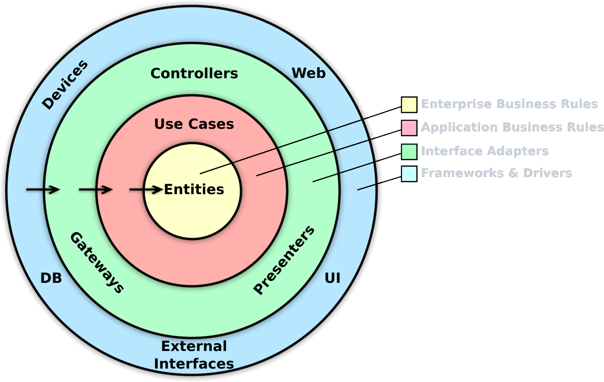

# ModularDynamicFeatureHilt

An Android template project following a multi module approach with clean architecture. It has been built following Clean Architecture Principle, Repository Pattern, MVVM Architecture in the presentation layer as well as jetpack components.

I created this repository to demonstrate best development practices by utilizing up to date tech-stack.

[](https://github.com/mbobiosio/ModularDynamicFeatureHilt/actions?query=workflow%3ABuild)

[](LICENSE)
[](https://ktlint.github.io/)


### Details
   - **Operating System** : Android
   - **Programming Language**: [Kotlin](https://kotlinlang.org)
   - **Architecture** : [MVVM and Data Binding](https://developer.android.com/jetpack/guide)
   - **Dependency Injection** : [Hilt](https://dagger.dev/hilt/)
   - **Fragment Management** : [Navigation Component](https://developer.android.com/guide/navigation/navigation-getting-started)
   - **Design** : [Material Design 3](https://m3.material.io)

## Prerequisite.

1. Android Studio : Arctic Fox | 2020.3.1	3.1 or higher
2. Android Emulator or Physical android device

## Disclaimer.

- Complex architectures like the pure clean architecture can also increase code complexity since decoupling your code also means creating lots of data transformations(mappers) and models,that may end up increasing the learning curve of your code to a point where it would be better to use a simpler architecture like MVVM.

- When using dynamic delivery you'll need a PlayStore Developer Account in order to test the dynamic delivery feature However, there is a work around by using [GloballyDynamic](https://globallydynamic.io/) which provides the same dynamic delivery capabilities as PlayStore with other added advantages well suited for testing. [Read More](https://proandroiddev.com/globallydynamic-dynamic-delivery-during-development-f28093ed184f).

- Dynamic feature modules require use of Android App Bundles which at the moment are not supported by all app distribution platforms and the platforms that support app bundles have different integrations. However, this can be solved by using [GloballyDynamic](https://globallydynamic.io/).

So let's get started ...

## App Structure
### Dynamic Feature Modules and Dynamic Delivery?

`Dynamic feature modules` allow separation of certain features and resources from the base module of the app and include them in the app bundle. User can then download and install these modules later when they are required(on demand) even after the app has already been installed.

`Dynamic Delivery` is Google Play's app serving model that uses [Android App Bundles](https://developer.android.com/guide/app-bundle) to generate and server optimized APKs for each user's device configuration so that users download only the feature and resources the need to run the app.

Play Feature Delivery allow certain features of the app to be delivered conditionally (depending on user's language, location/country, paying or free user etc.) or downloaded on demand.

## Architecture.

### What is Clean Architecture?

A well planned architecture is extremely important for an app to scale and all architectures have one common goal- to manage complexity of your app. This isn't something to be worried about in smaller apps however it may prove very useful when working on apps with longer development lifecycle and a bigger team.

Clean architecture was proposed by [Robert C. Martin](https://en.wikipedia.org/wiki/Robert_C._Martin) in 2012 in the [Clean Code Blog](http://blog.cleancoder.com/uncle-bob/2012/08/13/the-clean-architecture.html) and it follow the SOLID principle.

<p align="center"></p>

The circles represent different layers of your app. Note that:

- The center circle is the most abstract, and the outer circle is the most concrete. This is called the [Abstraction Principle](https://en.wikipedia.org/wiki/Abstraction_principle_(computer_programming)). The Abstraction Principle specifies that inner circles should contain business logic, and outer circles should contain implementation details.

- Another principle of Clean Architecture is the [Dependency Inversion](https://en.wikipedia.org/wiki/Dependency_inversion_principle). This rule specifies that each circle can depend only on the nearest inward circle ie. low-level modules do not depend on high-level modules but the other way around.

### Why Clean Architecture?

- Loose coupling between the code - The code can easily be modified without affecting any or a large part of the app's codebase.
- Easier to test code.
- Separation of Concern - Different modules have specific responsibilities making it easier for modification and maintenance.

### S.O.L.I.D Principles.

- [__Single Responsibility__](https://en.wikipedia.org/wiki/Single-responsibility_principle): Each software component should have only one reason to change – one responsibility.

- [__Open-Closed__](https://en.wikipedia.org/wiki/Open%E2%80%93closed_principle#:~:text=In%20object%2Doriented%20programming%2C%20the,without%20modifying%20its%20source%20code.): You should be able to extend the behavior of a component, without breaking its usage, or modifying its extensions.

- [__Liskov Substitution__](https://en.wikipedia.org/wiki/Liskov_substitution_principle): If you have a class of one type, and any subclasses of that class, you should be able to represent the base class usage with the subclass, without breaking the app.

- [__Interface Segregation__](https://en.wikipedia.org/wiki/Interface_segregation_principle): It’s better to have many smaller interfaces than a large one, to prevent the class from implementing the methods that it doesn’t need.

- [__Dependency Inversion__](https://en.wikipedia.org/wiki/Dependency_inversion_principle): Components should depend on abstractions rather than concrete implementations. Also higher level modules shouldn’t depend on lower level modules.

### Gradle Setup

- [GitHub Actions](https://github.com/mbobiosio/ModularDynamicFeatureHilt/actions) - GitHub actions is used in this project to check for syntax correctness using KtLint, execute the unit tests and generate a new package when pushing changes to the main branch.
- [KtLint](https://github.com/pinterest/ktlint) - The project uses KtLint to check for syntax correctness.
- [Detekt](https://github.com/detekt/detekt) - The project uses Detekt for Kotlin Static Analysis.

## Getting started

There are a few ways to open this project.

### Android Studio

1. `Android Studio` -> `File` -> `New` -> `From Version control` -> `Git`
2. Enter `git@github.com:mbobiosio/ModularDynamicFeatureHilt.git` into URL field an press `Clone` button
3, Build the project and run on an android device or emulator

### Command-line + Android Studio

1. Run `git clone git@github.com:mbobiosio/ModularDynamicFeatureHilt.git` command to clone project
2. Open `Android Studio` and select `File | Open...` from the menu. Select cloned directory and press `Open` button
3. Build the project and run on an android device or emulator

### Conclusion

This project is designed to be a barebone template for new apps.
This project will continuously receive updates to improve overall codebase and other libraries and techniques to keep it up to date.

### Screenshots

  

### Author

* [Mbuodile Obiosio](https://www.linkedin.com/in/mb-obiosio/)
* [](https://twitter.com/cazewonder)

## 📝 License
This project is released under the MIT license.
See [LICENSE](./LICENSE) for details.

```
MIT License

Copyright (c) 2022 Mbuodile Obiosio

Permission is hereby granted, free of charge, to any person obtaining a copy
of this software and associated documentation files (the "Software"), to deal
in the Software without restriction, including without limitation the rights
to use, copy, modify, merge, publish, distribute, sublicense, and/or sell
copies of the Software, and to permit persons to whom the Software is
furnished to do so, subject to the following conditions:

The above copyright notice and this permission notice shall be included in all
copies or substantial portions of the Software.

THE SOFTWARE IS PROVIDED "AS IS", WITHOUT WARRANTY OF ANY KIND, EXPRESS OR
IMPLIED, INCLUDING BUT NOT LIMITED TO THE WARRANTIES OF MERCHANTABILITY,
FITNESS FOR A PARTICULAR PURPOSE AND NONINFRINGEMENT. IN NO EVENT SHALL THE
AUTHORS OR COPYRIGHT HOLDERS BE LIABLE FOR ANY CLAIM, DAMAGES OR OTHER
LIABILITY, WHETHER IN AN ACTION OF CONTRACT, TORT OR OTHERWISE, ARISING FROM,
OUT OF OR IN CONNECTION WITH THE SOFTWARE OR THE USE OR OTHER DEALINGS IN THE
SOFTWARE.
```